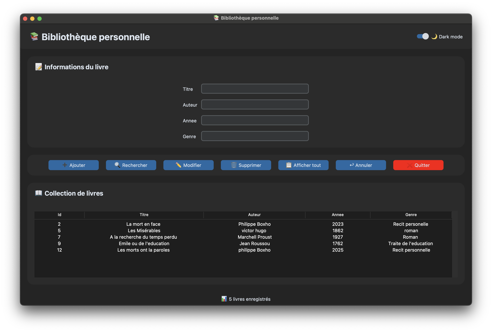
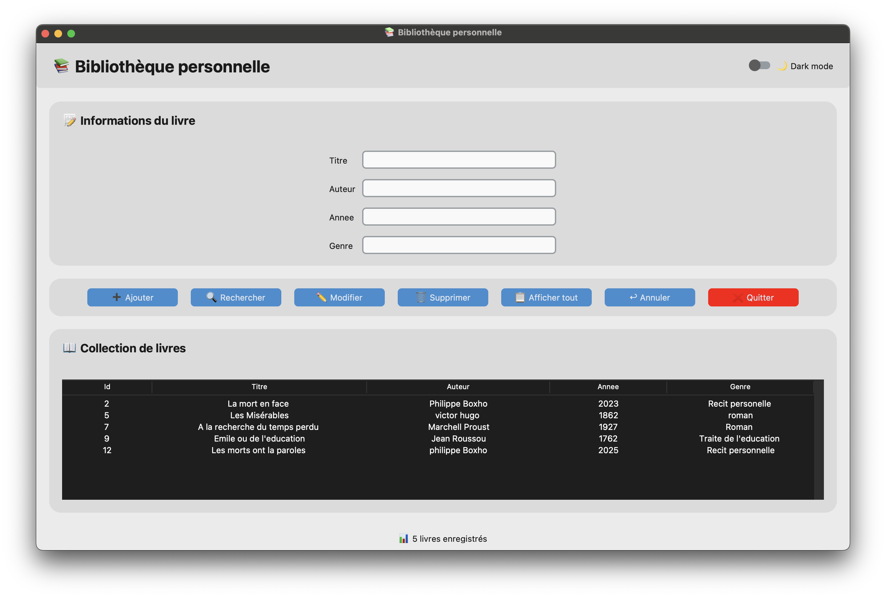

# bibliotheque App
### This is a simple  library management app Builded with python based on the MVC architecture,

MVC architecture is a software design pattern that divides an application into three interconnected parts: the Model, the View, and the Controller, to separate data handling from user interface design,

> [!NOTE]
> This project was developed using Python 3, along with the CustomTkinter and SQLite libraries. These dependencies are required to run the project.

**Dark mode** :crescent_moon:

**Light mode** :sunny:

